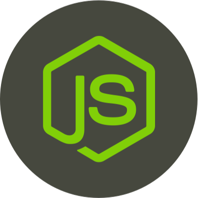

I'm a software sorcerer in training from South Korea KR

About Me
- 🎓 I'm majoring in Computer Software Engineering at Wonkwang Univ.
- 💻 I enjoy C-family languages
- 🚀 I'm interested in Kotlin and JavaScript (TypeScript)
- 🐘 I prefer PostgreSQL

  <code></code>
  <code></code>
  <code></code>
  <code></code>
  <code></code> 
  <code></code>
  <code></code>
  <code></code>
  <code></code>  

  

